# FP4 Documentation

### Part 1
#### In 300 words describe your website 
My portfolio website is designed to showcase my skills as a product designer through a visually engaging and interactive experience. The primary purpose of the website is to highlight my design expertise, creativity, and technical competency to potential employers, specifically hiring managers in product design and UX roles.
The website features key sections, including an "About Me" page that tells my personal story and design philosophy, and a "Work" section showcasing selected projects with case studies. I want to show that I am an experienced designer, with a good understanding of UX for industry, with an interest in strategic thinking and domain complexity.
What makes my portfolio intersting and engaging is the integration of little animations and interactive elements, providing a delightful experience scanning through my portfolio. These little elements are balanced with a clean, simple, and standard layout that ensures quick navigation and a professional presentation.
The target audience for my portfolio includes hiring managers, recruiters, and design professionals who are evaluating candidates for product design roles. By balancing standard, accessible portfolio features with novel, enjoyable elements, my website creates a lasting impression, effectively demonstrating my skills while offering a user-friendly experience tailored to the expectations of my industry.

### Part 2
#### Use a bulleted list to describe how a user would interact with your website. 
* Progressive Header with SVG Tracing (Work page) - the SVG icons trace and fill up while the header animates progressively to add delight.
* Custom cursor (Work page) - on hovering over a project card, a custome cursor appears.
* Delightful description (About page) - the description animates progressively to add delight
* Images moving in on Project Pages - the descriptive images move into the frame on the project pages
* Hobbies carousel (About page) - there is a carousel of images on the About page, the images move at a certain speed and on hover, the speed reduces, focusing the carousel. On hover, there is also an overlay with a description.
* Art + ideas (About page) - there is an art wall with draggable cards with messages, the cards have some momentum to add interactivity to the section.

### Part 3
#### Describe what external tool you used (JavaScript library, Web API, animations, or other).
* Name of tool - Framer Motion React Library
* Why did you choose to use it? - I chose Framer Motion for its ease of use and flexibility in creating smooth, interactive animations. It integrates seamlessly with React, allowing me to enhance the visual and interactive appeal of my portfolio without adding unnecessary complexity.
* How did you used it? - I used it to animate project cards, the hero banner and SVGs part of it, to add some interactivity to the About page, and for general scroll animations on the project pages.
* What does it add to your website? - Framer Motion makes the portfolio more visually appealing and interactive, adding a layer of delight and sophistication. The animations help guide the user’s attention and add a polished, professional feel.

### Part 4
#### Describe how you iterated on your prototypes, if at all, including any changes you made to your original design while you were implementing your website.

While implementing my site, I decided to get rid of the winding path on the work page as it did not convey the right message visually. I went with a stacking cards approach instead which added a dynamic feel to the page compared to a simple layout. I did find it difficult to get resources to implement the exact style I wanted so I ended up resorting to a simpler structure in the interest of time.
I do feel that I did a good job scoping this project and was very realistic with what I could achieve in the span of a few weeks. Although I did struggle with some parts of the animations, I was still able to push myself and finish coding almost all of it.

### Part 5
#### What challenges did you experience in implementing your website?
One challenge I faced was the learning curve with Framer Motion, particularly understanding its new syntax and integrating it into my React code effectively. Coding in the styles was another major hurdle as I wanted to make a really cohesive design system for my site. I also found debugging quite hard when I ran into weird, unexpected errors, and ChatGPT did help me dig into my code in cases like this.

### Part 6
#### Describe how you used Generative AI tools to create this final project

* I used ChatGPT. This tool served as a tutor for learning concepts, a debugging assistant when I encountered errors, and a source for template code for basic components, which I then customized to suit my design and functionality requirements.

* AI helped me generate boilerplate code just for some basic components like cards, navbars, footers, etc. just so I have a basic codebase to edit. For eg. an onScroll progress bar for a page is quite generic, so I asked ChatGPT to help me generate code for it, and I modified styling and parameters according to my liking. I usually critique prompts by first trying to see if they make sense to the eye, but I mainly test through pasting the output into my editor and seeing the output. If it’s close to the desired output, I make edits and change the code as needed, otherwise I re-prompt accordingly. My design was usually never influenced by the output as I always edited it to make the site look the way I intended. ChatGPT just helped me speed up my process, and helped me in places where I couldn’t find errors. 

* AI sometimes gives outputs that look okay but absolutely do not work in the intended way when executed. It cannot give complete outputs from scratch for complex prompts, having code to work with that I pulled from another site or a video was usually a good jumping off point for ChatGPT to edit and help me out. It can do basic code really well and that is where its strengths lie, it’s not the best for really complex interactions/descriptions. In those cases it might just be faster to write the code from scratch than to prompt the AI. A specific limitation I found was when I asked AI to help me make my site responsive by supplying it my code - it didn’t really work, I had to write the code manually. I was initially pleased with ChatGPT, but overall quite shocked at how deceptively low-quality some of the outputs were, and how sometimes AI would completely misunderstand or ignore things that I would ask it to do. Although, the most useful case is probably for debugging and parsing code to see where errors come from.

_Example of error debugging_

_Example of asking for a component_

_Example of using it for explanations_

_Example of AI giving a strange hallucination as an output_

# Appendix (Accessibility + Responsivity)

### Accessibility
I used discretion in deciding which images need alt text and which don't - I used an ARIA attribute to ignore decorative elements while parsing the page. I also made sure to use semantic elements and clean code. I also commented my code and used approrpiate naming to make the code easy for others to understand. I had to make some tweaks to my color palette midway through the project when I did my first accessibility evaluation.

Here are some screenshots to show accessibility from the WAVE Evaluation tool of the Work page, the About page, and one example Project page.

#### Work Page
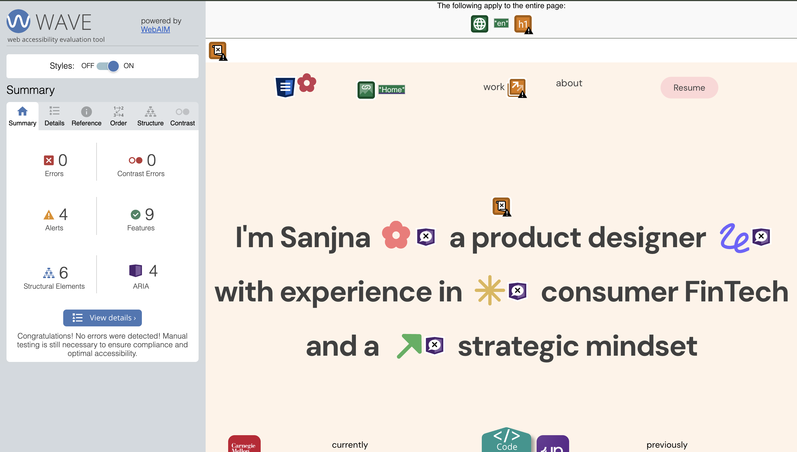
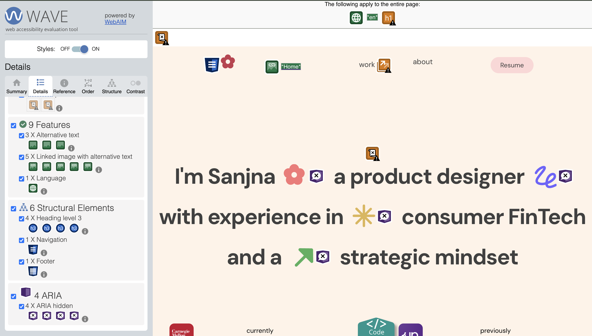

#### About Page
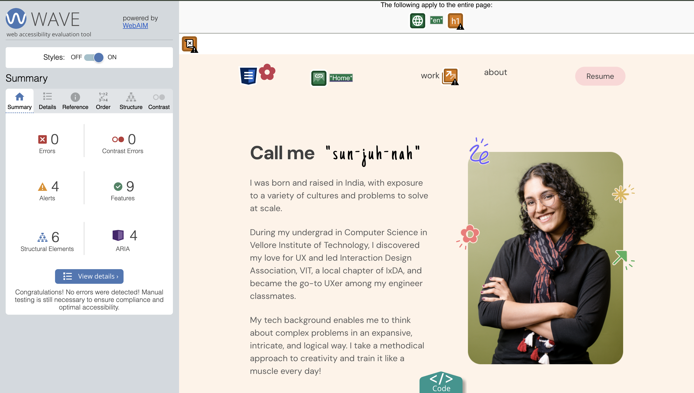
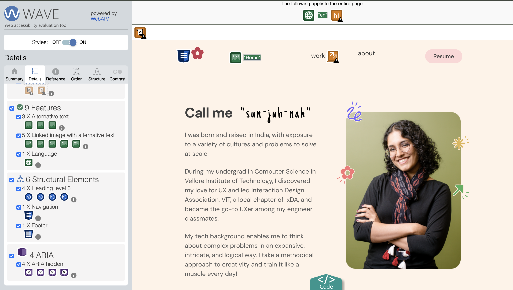

#### Project Page 
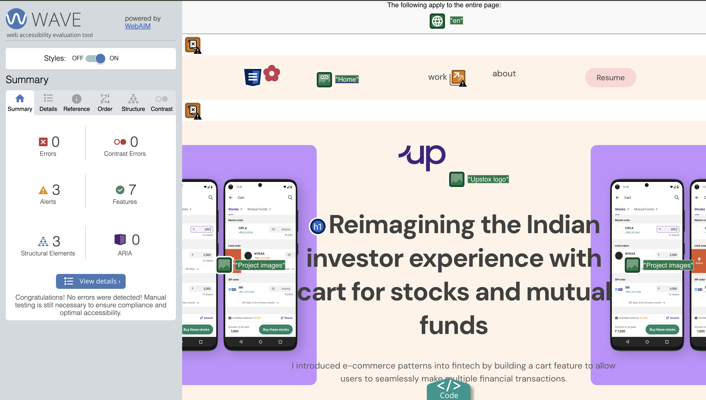
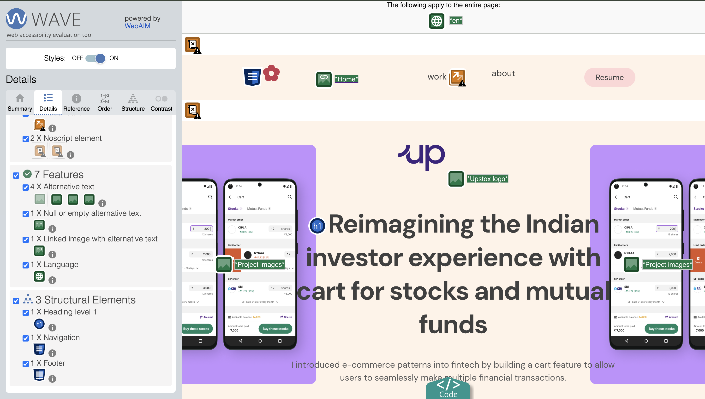

### Responsivity
Please test this website between the following maximum and minimum screen sizes,
* Max width (Desktop) = 1440px
* Min Width (for example, iPad Air) = 820px

#### Some Screenshots

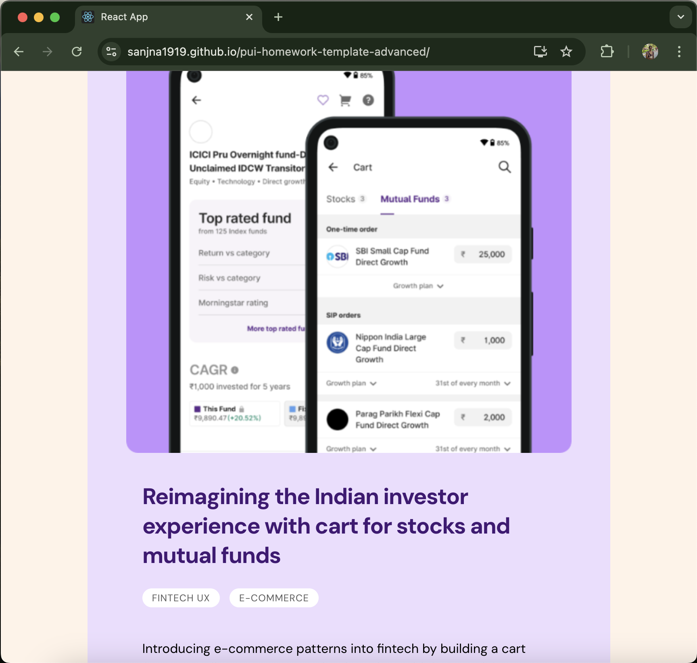

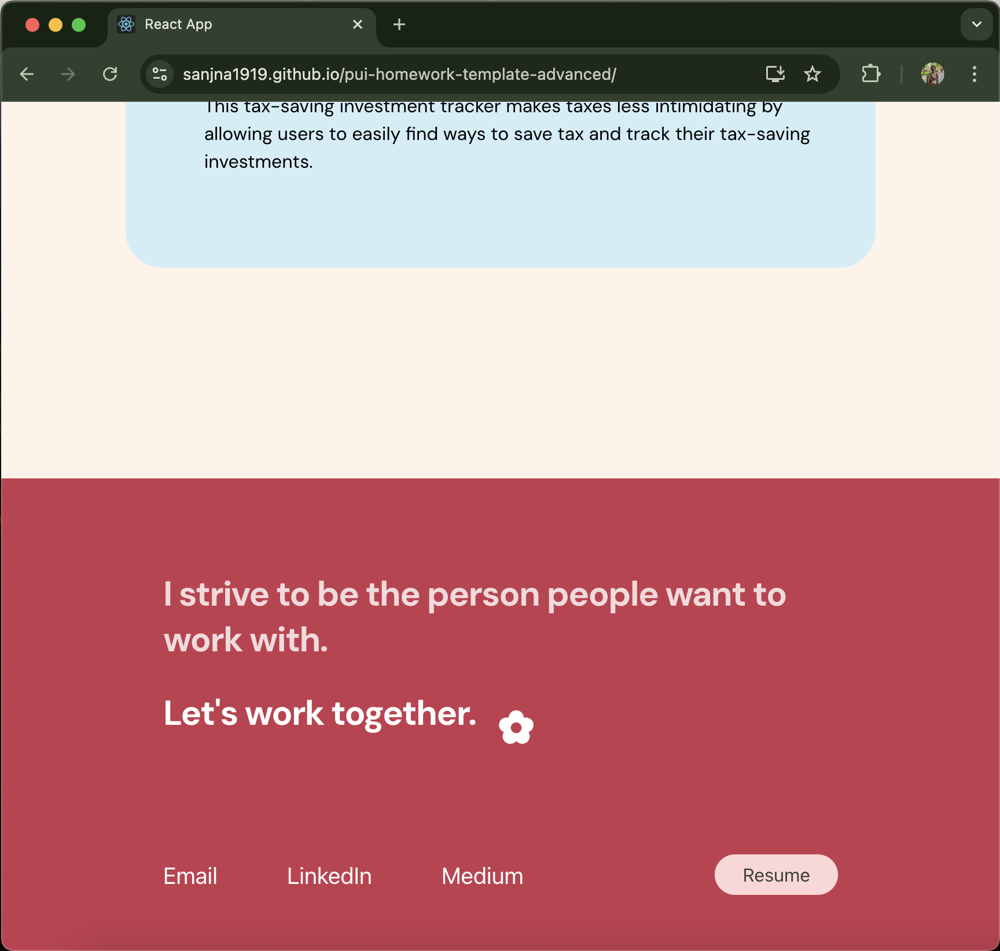

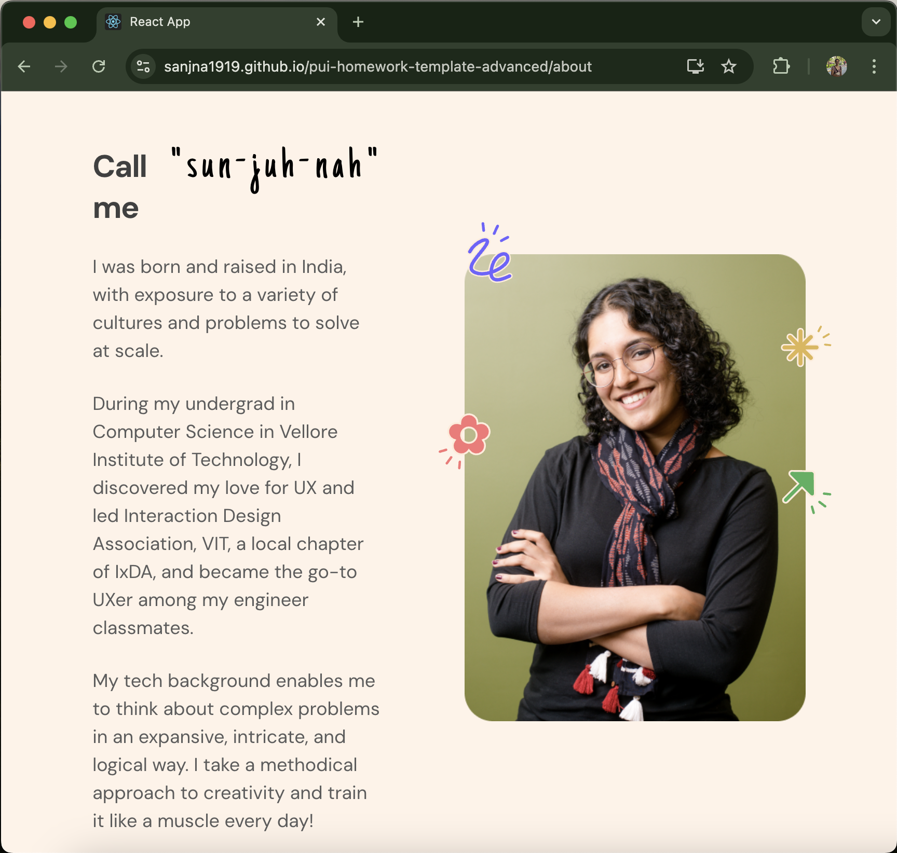

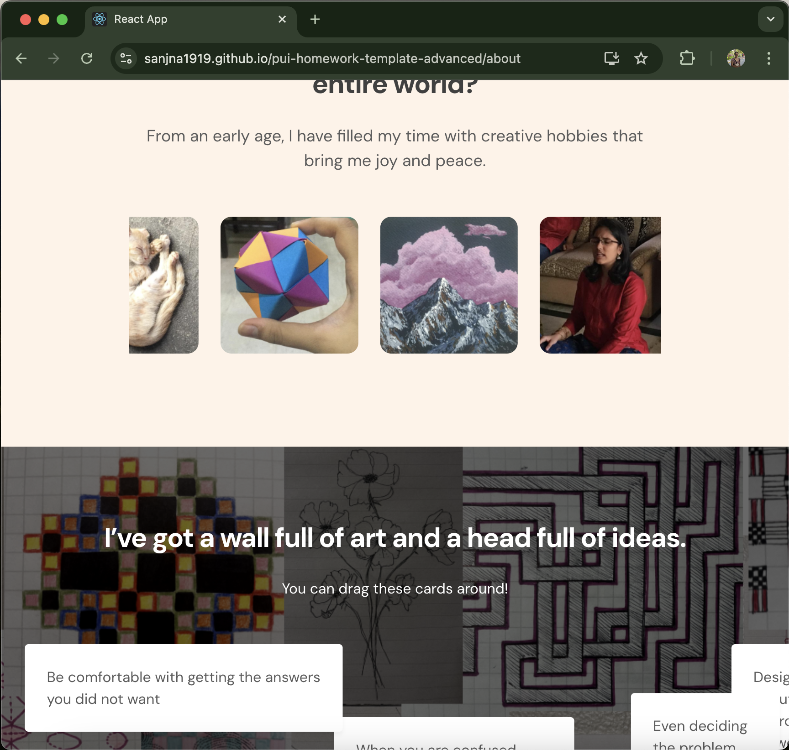

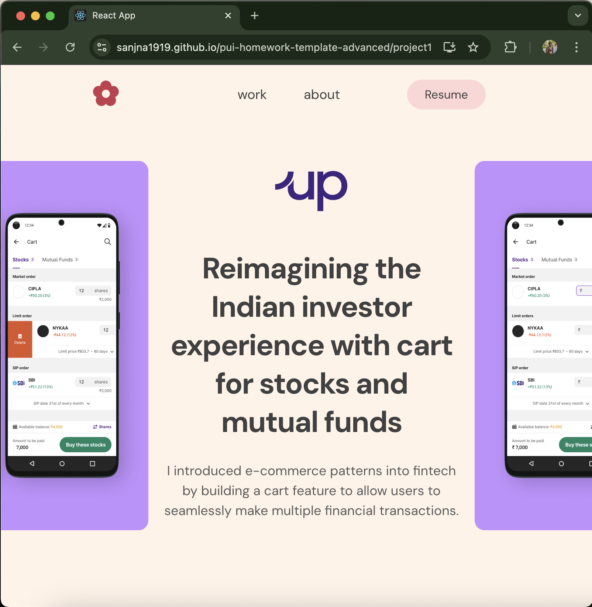

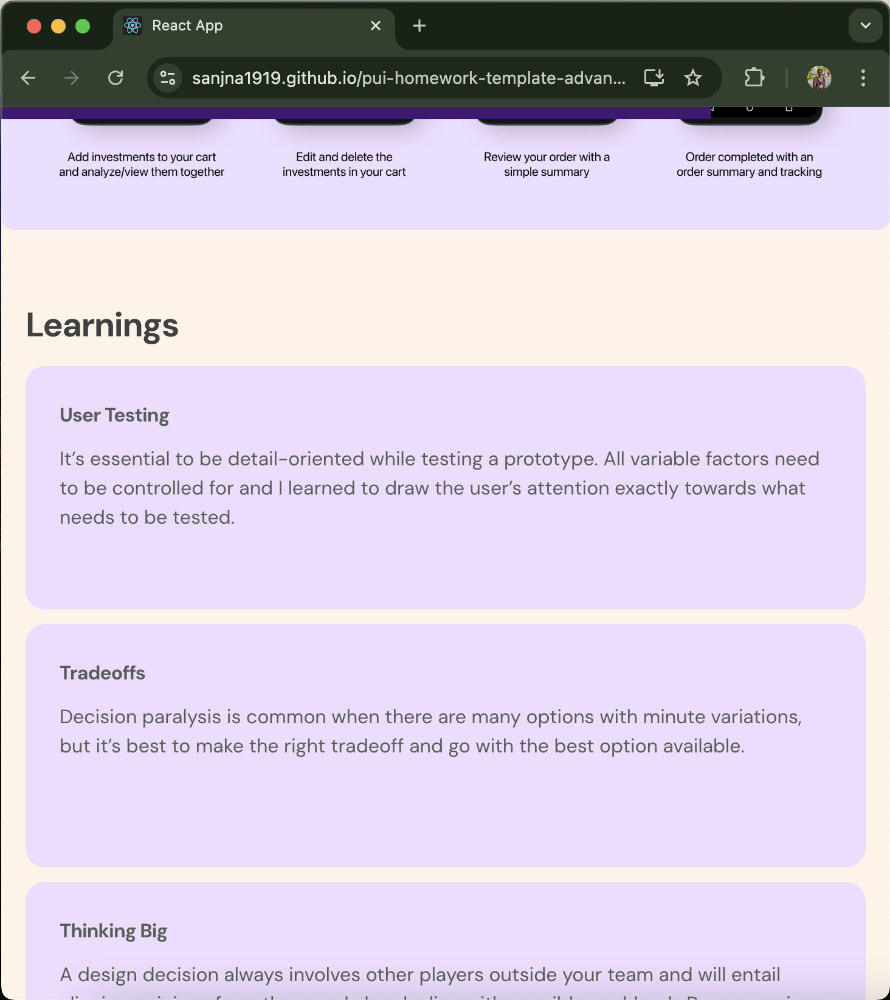

#### Note: I have used image imports for some of the images since using the image paths normally was not working post-deployment.
